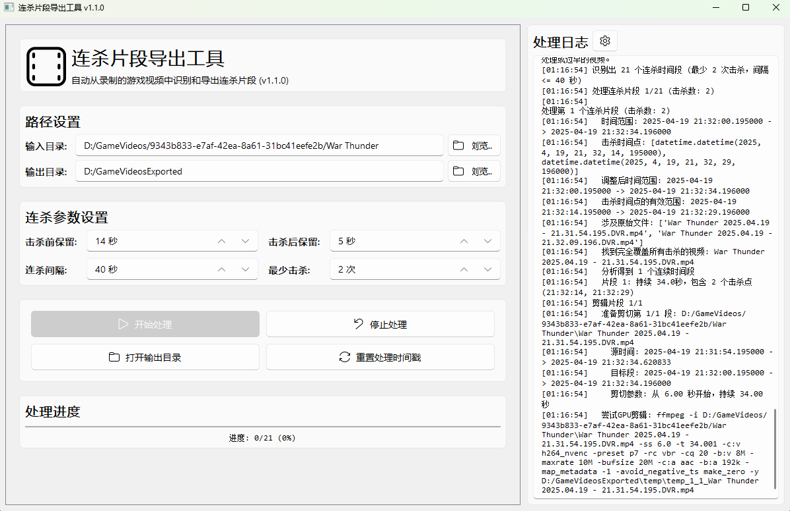

# 战雷连杀片段导出工具

一个用于自动从战雷(War Thunder)游戏录制视频中识别和导出连杀片段的工具。基于PyQt5和PyQt-Fluent-Widgets实现现代化UI界面。



## 功能特点

- 自动识别连杀片段，支持设置连杀时间阈值和最少击杀数
- 自动选择最佳视频源，优先单视频覆盖，必要时多视频拼接
- 支持GPU和CPU编码，自动切换
- 现代化UI界面，提供友好的用户体验

## 项目结构

```
.
├── exporter/               # 核心包
│   ├── core/               # 核心处理模块
│   │   ├── models.py       # 数据模型
│   │   └── processor.py    # 视频处理逻辑
│   └── utils/              # 工具模块
│       ├── constants.py    # 常量定义
│       ├── ffmpeg_utils.py # FFmpeg工具函数
│       └── file_utils.py   # 文件处理工具函数
├── build.py                # 构建脚本
├── requirements.txt        # 依赖要求
└── wt_killstreak_exporter.py  # 主程序（GUI界面）
```

## 安装和使用

### 依赖项

- Python 3.6+
- PyQt5
- PyQt-Fluent-Widgets
- FFmpeg (需要在系统PATH中可用)

### 安装依赖

```bash
pip install -r requirements.txt
```

### 运行程序

```bash
python wt_killstreak_exporter.py
```

### 打包程序

```bash
python build.py
```

## 许可证

项目使用 MIT 许可证 - 详见 LICENSE 文件

## 贡献

欢迎贡献！如果您发现任何问题或有改进建议，请提交issue或pull request。

