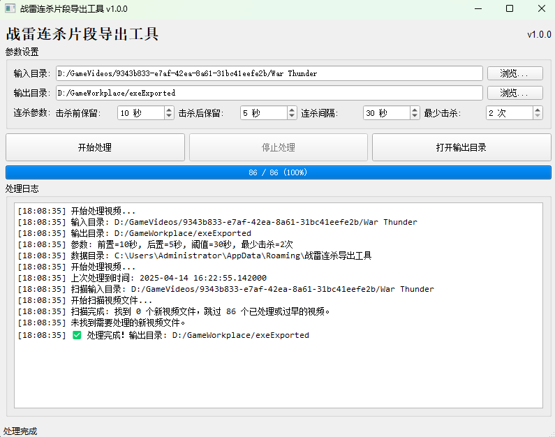

# 战雷连杀片段导出工具

一款用于自动从录制的《战争雷霆》(War Thunder) 游戏视频中识别和导出连杀片段的工具。帮助玩家轻松获取精彩战斗瞬间，无需手动剪辑。

## 主要功能

- 🎮 自动识别N卡录像导出的《战争雷霆》连杀片段
- 🎬 智能剪辑并合并连续击杀场景
- 🧠 使用智能算法避免重复片段
- 📋 精确控制击杀前后保留时间
- 💾 保存处理状态，避免重复处理
- 🖥️ 直观易用的图形界面
- 🚀 支持GPU加速（NVENC）和CPU编码

## 系统要求

- Windows 10/11 操作系统
- 安装了FFmpeg和FFprobe（程序会自动检测或指导安装）
- 支持NVENC的NVIDIA显卡（可选，用于加速视频处理）

## 安装和使用

### 方法1：直接运行（推荐）

1. 从[发布页面](https://github.com/Aression/GameWorkplace/releases)下载最新版本
2. 解压文件到任意位置
3. 运行 `战雷连杀导出工具.exe`

### 方法2：从源码运行

1. 安装Python 3.8或更高版本
2. 克隆或下载此仓库
3. 安装依赖：`pip install -r requirements.txt`
4. 运行主程序：`python wt_killstreak_exporter.py`

### 安装FFmpeg（如果没有）

1. 从[FFmpeg官网](https://ffmpeg.org/download.html)下载FFmpeg
2. 将ffmpeg.exe和ffprobe.exe添加到系统PATH环境变量
3. 或者将这两个文件放在程序同一目录下

## 使用方法

1. 启动程序
2. 选择输入目录（《战争雷霆》游戏录像所在文件夹）
3. 选择输出目录（处理后的连杀片段将保存到此文件夹）
4. 根据需要调整参数：
   - **击杀前保留**：第一次击杀前保留的时间（秒）
   - **击杀后保留**：最后一次击杀后保留的时间（秒）
   - **连杀间隔**：两次击杀之间的最大时间间隔（秒）
   - **最少击杀**：构成连杀的最少击杀数量
5. 点击"开始处理"按钮
6. 处理完成后，输出目录中将生成命名格式为`连杀X_YYYYMMDD_HHMMSS_组Z.mp4`的视频文件，其中：
   - X表示连杀数
   - YYYYMMDD_HHMMSS表示录制时间
   - Z表示连杀组序号

## 开发者信息

更多安装信息参照 [安装指南](./doc/INSTALL.md)

## 许可证

本项目采用 MIT 许可证 - 详见 [LICENSE](LICENSE) 文件

## 贡献

欢迎贡献！如果您发现任何问题或有改进建议，请提交issue或pull request。 